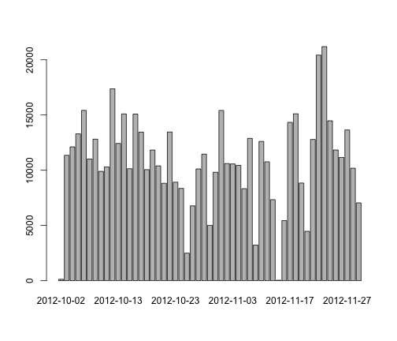
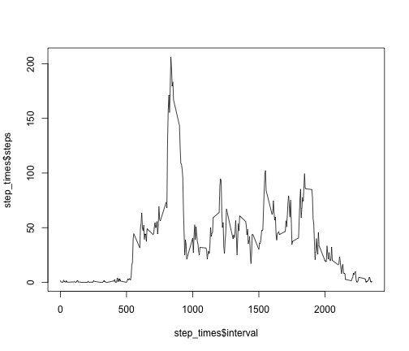
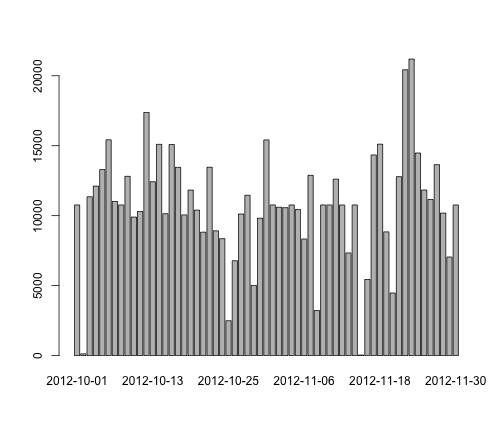
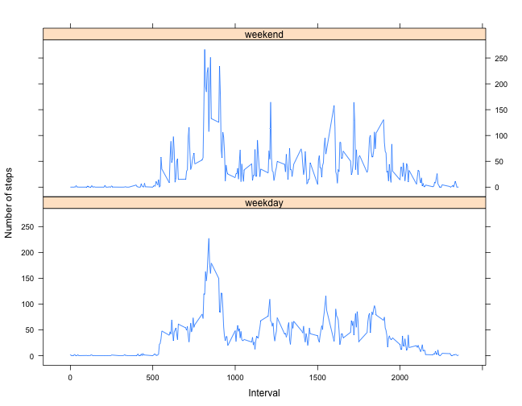

Reproducible Reaserch class - project 1
========================================================

##  Loading and preprocessing the data

Intiatilize, read in the data and calculate sums, means and medians:


```r
library(lattice)
library(xtable)

act_dat <- read.csv("activity.csv")

sums <- aggregate(steps ~ date, act_dat, sum)
means <- aggregate(steps ~ date, act_dat, mean)
medians <- aggregate(steps ~ date, act_dat, median)
```


## What is mean total number of steps taken per day?

Histogram for the total number of steps:


```r
barplot(sums$steps, names.arg = sums$date)
```

 


Mean and median values:

```r
combined <- merge(means, medians, by = "date")
names(combined) <- c("Date", "Mean", "Median")
combined$Mean <- format(combined$Mean, digits = 1)
```


Format the table for display

```r
combined_table <- xtable(combined)
print(combined_table, type = "html")
```

<!-- html table generated in R 3.0.2 by xtable 1.7-3 package -->
<!-- Tue May 13 11:06:15 2014 -->
<TABLE border=1>
<TR> <TH>  </TH> <TH> Date </TH> <TH> Mean </TH> <TH> Median </TH>  </TR>
  <TR> <TD align="right"> 1 </TD> <TD> 2012-10-02 </TD> <TD>  0.4 </TD> <TD align="right"> 0.00 </TD> </TR>
  <TR> <TD align="right"> 2 </TD> <TD> 2012-10-03 </TD> <TD> 39.4 </TD> <TD align="right"> 0.00 </TD> </TR>
  <TR> <TD align="right"> 3 </TD> <TD> 2012-10-04 </TD> <TD> 42.1 </TD> <TD align="right"> 0.00 </TD> </TR>
  <TR> <TD align="right"> 4 </TD> <TD> 2012-10-05 </TD> <TD> 46.2 </TD> <TD align="right"> 0.00 </TD> </TR>
  <TR> <TD align="right"> 5 </TD> <TD> 2012-10-06 </TD> <TD> 53.5 </TD> <TD align="right"> 0.00 </TD> </TR>
  <TR> <TD align="right"> 6 </TD> <TD> 2012-10-07 </TD> <TD> 38.2 </TD> <TD align="right"> 0.00 </TD> </TR>
  <TR> <TD align="right"> 7 </TD> <TD> 2012-10-09 </TD> <TD> 44.5 </TD> <TD align="right"> 0.00 </TD> </TR>
  <TR> <TD align="right"> 8 </TD> <TD> 2012-10-10 </TD> <TD> 34.4 </TD> <TD align="right"> 0.00 </TD> </TR>
  <TR> <TD align="right"> 9 </TD> <TD> 2012-10-11 </TD> <TD> 35.8 </TD> <TD align="right"> 0.00 </TD> </TR>
  <TR> <TD align="right"> 10 </TD> <TD> 2012-10-12 </TD> <TD> 60.4 </TD> <TD align="right"> 0.00 </TD> </TR>
  <TR> <TD align="right"> 11 </TD> <TD> 2012-10-13 </TD> <TD> 43.1 </TD> <TD align="right"> 0.00 </TD> </TR>
  <TR> <TD align="right"> 12 </TD> <TD> 2012-10-14 </TD> <TD> 52.4 </TD> <TD align="right"> 0.00 </TD> </TR>
  <TR> <TD align="right"> 13 </TD> <TD> 2012-10-15 </TD> <TD> 35.2 </TD> <TD align="right"> 0.00 </TD> </TR>
  <TR> <TD align="right"> 14 </TD> <TD> 2012-10-16 </TD> <TD> 52.4 </TD> <TD align="right"> 0.00 </TD> </TR>
  <TR> <TD align="right"> 15 </TD> <TD> 2012-10-17 </TD> <TD> 46.7 </TD> <TD align="right"> 0.00 </TD> </TR>
  <TR> <TD align="right"> 16 </TD> <TD> 2012-10-18 </TD> <TD> 34.9 </TD> <TD align="right"> 0.00 </TD> </TR>
  <TR> <TD align="right"> 17 </TD> <TD> 2012-10-19 </TD> <TD> 41.1 </TD> <TD align="right"> 0.00 </TD> </TR>
  <TR> <TD align="right"> 18 </TD> <TD> 2012-10-20 </TD> <TD> 36.1 </TD> <TD align="right"> 0.00 </TD> </TR>
  <TR> <TD align="right"> 19 </TD> <TD> 2012-10-21 </TD> <TD> 30.6 </TD> <TD align="right"> 0.00 </TD> </TR>
  <TR> <TD align="right"> 20 </TD> <TD> 2012-10-22 </TD> <TD> 46.7 </TD> <TD align="right"> 0.00 </TD> </TR>
  <TR> <TD align="right"> 21 </TD> <TD> 2012-10-23 </TD> <TD> 31.0 </TD> <TD align="right"> 0.00 </TD> </TR>
  <TR> <TD align="right"> 22 </TD> <TD> 2012-10-24 </TD> <TD> 29.0 </TD> <TD align="right"> 0.00 </TD> </TR>
  <TR> <TD align="right"> 23 </TD> <TD> 2012-10-25 </TD> <TD>  8.7 </TD> <TD align="right"> 0.00 </TD> </TR>
  <TR> <TD align="right"> 24 </TD> <TD> 2012-10-26 </TD> <TD> 23.5 </TD> <TD align="right"> 0.00 </TD> </TR>
  <TR> <TD align="right"> 25 </TD> <TD> 2012-10-27 </TD> <TD> 35.1 </TD> <TD align="right"> 0.00 </TD> </TR>
  <TR> <TD align="right"> 26 </TD> <TD> 2012-10-28 </TD> <TD> 39.8 </TD> <TD align="right"> 0.00 </TD> </TR>
  <TR> <TD align="right"> 27 </TD> <TD> 2012-10-29 </TD> <TD> 17.4 </TD> <TD align="right"> 0.00 </TD> </TR>
  <TR> <TD align="right"> 28 </TD> <TD> 2012-10-30 </TD> <TD> 34.1 </TD> <TD align="right"> 0.00 </TD> </TR>
  <TR> <TD align="right"> 29 </TD> <TD> 2012-10-31 </TD> <TD> 53.5 </TD> <TD align="right"> 0.00 </TD> </TR>
  <TR> <TD align="right"> 30 </TD> <TD> 2012-11-02 </TD> <TD> 36.8 </TD> <TD align="right"> 0.00 </TD> </TR>
  <TR> <TD align="right"> 31 </TD> <TD> 2012-11-03 </TD> <TD> 36.7 </TD> <TD align="right"> 0.00 </TD> </TR>
  <TR> <TD align="right"> 32 </TD> <TD> 2012-11-05 </TD> <TD> 36.2 </TD> <TD align="right"> 0.00 </TD> </TR>
  <TR> <TD align="right"> 33 </TD> <TD> 2012-11-06 </TD> <TD> 28.9 </TD> <TD align="right"> 0.00 </TD> </TR>
  <TR> <TD align="right"> 34 </TD> <TD> 2012-11-07 </TD> <TD> 44.7 </TD> <TD align="right"> 0.00 </TD> </TR>
  <TR> <TD align="right"> 35 </TD> <TD> 2012-11-08 </TD> <TD> 11.2 </TD> <TD align="right"> 0.00 </TD> </TR>
  <TR> <TD align="right"> 36 </TD> <TD> 2012-11-11 </TD> <TD> 43.8 </TD> <TD align="right"> 0.00 </TD> </TR>
  <TR> <TD align="right"> 37 </TD> <TD> 2012-11-12 </TD> <TD> 37.4 </TD> <TD align="right"> 0.00 </TD> </TR>
  <TR> <TD align="right"> 38 </TD> <TD> 2012-11-13 </TD> <TD> 25.5 </TD> <TD align="right"> 0.00 </TD> </TR>
  <TR> <TD align="right"> 39 </TD> <TD> 2012-11-15 </TD> <TD>  0.1 </TD> <TD align="right"> 0.00 </TD> </TR>
  <TR> <TD align="right"> 40 </TD> <TD> 2012-11-16 </TD> <TD> 18.9 </TD> <TD align="right"> 0.00 </TD> </TR>
  <TR> <TD align="right"> 41 </TD> <TD> 2012-11-17 </TD> <TD> 49.8 </TD> <TD align="right"> 0.00 </TD> </TR>
  <TR> <TD align="right"> 42 </TD> <TD> 2012-11-18 </TD> <TD> 52.5 </TD> <TD align="right"> 0.00 </TD> </TR>
  <TR> <TD align="right"> 43 </TD> <TD> 2012-11-19 </TD> <TD> 30.7 </TD> <TD align="right"> 0.00 </TD> </TR>
  <TR> <TD align="right"> 44 </TD> <TD> 2012-11-20 </TD> <TD> 15.5 </TD> <TD align="right"> 0.00 </TD> </TR>
  <TR> <TD align="right"> 45 </TD> <TD> 2012-11-21 </TD> <TD> 44.4 </TD> <TD align="right"> 0.00 </TD> </TR>
  <TR> <TD align="right"> 46 </TD> <TD> 2012-11-22 </TD> <TD> 70.9 </TD> <TD align="right"> 0.00 </TD> </TR>
  <TR> <TD align="right"> 47 </TD> <TD> 2012-11-23 </TD> <TD> 73.6 </TD> <TD align="right"> 0.00 </TD> </TR>
  <TR> <TD align="right"> 48 </TD> <TD> 2012-11-24 </TD> <TD> 50.3 </TD> <TD align="right"> 0.00 </TD> </TR>
  <TR> <TD align="right"> 49 </TD> <TD> 2012-11-25 </TD> <TD> 41.1 </TD> <TD align="right"> 0.00 </TD> </TR>
  <TR> <TD align="right"> 50 </TD> <TD> 2012-11-26 </TD> <TD> 38.8 </TD> <TD align="right"> 0.00 </TD> </TR>
  <TR> <TD align="right"> 51 </TD> <TD> 2012-11-27 </TD> <TD> 47.4 </TD> <TD align="right"> 0.00 </TD> </TR>
  <TR> <TD align="right"> 52 </TD> <TD> 2012-11-28 </TD> <TD> 35.4 </TD> <TD align="right"> 0.00 </TD> </TR>
  <TR> <TD align="right"> 53 </TD> <TD> 2012-11-29 </TD> <TD> 24.5 </TD> <TD align="right"> 0.00 </TD> </TR>
   </TABLE>


## What is the average daily activity pattern?

Grouping the data by intervals so we can plot daily activity patterns


```r
step_times <- aggregate(steps ~ interval, act_dat, mean)
```


Then generate the plot


```r
plot(step_times$interval, step_times$steps, type = "l")
```

 


Find index for interval with the maximum steps, and display the interval index number


```r
max_interval = step_times[which.max(step_times$step), ]$interval
max_interval
```

```
## [1] 835
```


## Imputing missing values

Find number of missing values (NA's)

```r
number_of_missing <- sum(is.na(act_dat$steps))
number_of_missing
```

```
## [1] 2304
```


To fill in the missing values, let's use average for that interval.
Loop through the data frame and replace NA's and get the right value from step_times.


```r
for (row in 1:length(act_dat$steps)) {
    if (is.na(act_dat$steps[row])) {
        act_dat$steps[row] <- step_times[step_times$interval == act_dat$interval[row], 
            ]$steps
    }
}
```


Now we can take sums, means and medians for the values

```r
sums2 <- aggregate(steps ~ date, act_dat, sum)
means2 <- aggregate(steps ~ date, act_dat, mean)
medians2 <- aggregate(steps ~ date, act_dat, median)
```


Histogram for the total number of steps with the new "filled in" data:


```r
barplot(sums2$steps, names.arg = sums2$date)
```

 


Combined data so we can see numerical values:


```r
combined2 <- merge(means2, medians2, by = "date")
names(combined2) <- c("Date", "Mean", "Median")
combined2$Mean <- format(combined2$Mean, digits = 1)
```


Format the table for display

```r
combined_table <- xtable(combined2)
print(combined_table, type = "html")
```

<!-- html table generated in R 3.0.2 by xtable 1.7-3 package -->
<!-- Tue May 13 11:06:18 2014 -->
<TABLE border=1>
<TR> <TH>  </TH> <TH> Date </TH> <TH> Mean </TH> <TH> Median </TH>  </TR>
  <TR> <TD align="right"> 1 </TD> <TD> 2012-10-01 </TD> <TD> 37.4 </TD> <TD align="right"> 34.11 </TD> </TR>
  <TR> <TD align="right"> 2 </TD> <TD> 2012-10-02 </TD> <TD>  0.4 </TD> <TD align="right"> 0.00 </TD> </TR>
  <TR> <TD align="right"> 3 </TD> <TD> 2012-10-03 </TD> <TD> 39.4 </TD> <TD align="right"> 0.00 </TD> </TR>
  <TR> <TD align="right"> 4 </TD> <TD> 2012-10-04 </TD> <TD> 42.1 </TD> <TD align="right"> 0.00 </TD> </TR>
  <TR> <TD align="right"> 5 </TD> <TD> 2012-10-05 </TD> <TD> 46.2 </TD> <TD align="right"> 0.00 </TD> </TR>
  <TR> <TD align="right"> 6 </TD> <TD> 2012-10-06 </TD> <TD> 53.5 </TD> <TD align="right"> 0.00 </TD> </TR>
  <TR> <TD align="right"> 7 </TD> <TD> 2012-10-07 </TD> <TD> 38.2 </TD> <TD align="right"> 0.00 </TD> </TR>
  <TR> <TD align="right"> 8 </TD> <TD> 2012-10-08 </TD> <TD> 37.4 </TD> <TD align="right"> 34.11 </TD> </TR>
  <TR> <TD align="right"> 9 </TD> <TD> 2012-10-09 </TD> <TD> 44.5 </TD> <TD align="right"> 0.00 </TD> </TR>
  <TR> <TD align="right"> 10 </TD> <TD> 2012-10-10 </TD> <TD> 34.4 </TD> <TD align="right"> 0.00 </TD> </TR>
  <TR> <TD align="right"> 11 </TD> <TD> 2012-10-11 </TD> <TD> 35.8 </TD> <TD align="right"> 0.00 </TD> </TR>
  <TR> <TD align="right"> 12 </TD> <TD> 2012-10-12 </TD> <TD> 60.4 </TD> <TD align="right"> 0.00 </TD> </TR>
  <TR> <TD align="right"> 13 </TD> <TD> 2012-10-13 </TD> <TD> 43.1 </TD> <TD align="right"> 0.00 </TD> </TR>
  <TR> <TD align="right"> 14 </TD> <TD> 2012-10-14 </TD> <TD> 52.4 </TD> <TD align="right"> 0.00 </TD> </TR>
  <TR> <TD align="right"> 15 </TD> <TD> 2012-10-15 </TD> <TD> 35.2 </TD> <TD align="right"> 0.00 </TD> </TR>
  <TR> <TD align="right"> 16 </TD> <TD> 2012-10-16 </TD> <TD> 52.4 </TD> <TD align="right"> 0.00 </TD> </TR>
  <TR> <TD align="right"> 17 </TD> <TD> 2012-10-17 </TD> <TD> 46.7 </TD> <TD align="right"> 0.00 </TD> </TR>
  <TR> <TD align="right"> 18 </TD> <TD> 2012-10-18 </TD> <TD> 34.9 </TD> <TD align="right"> 0.00 </TD> </TR>
  <TR> <TD align="right"> 19 </TD> <TD> 2012-10-19 </TD> <TD> 41.1 </TD> <TD align="right"> 0.00 </TD> </TR>
  <TR> <TD align="right"> 20 </TD> <TD> 2012-10-20 </TD> <TD> 36.1 </TD> <TD align="right"> 0.00 </TD> </TR>
  <TR> <TD align="right"> 21 </TD> <TD> 2012-10-21 </TD> <TD> 30.6 </TD> <TD align="right"> 0.00 </TD> </TR>
  <TR> <TD align="right"> 22 </TD> <TD> 2012-10-22 </TD> <TD> 46.7 </TD> <TD align="right"> 0.00 </TD> </TR>
  <TR> <TD align="right"> 23 </TD> <TD> 2012-10-23 </TD> <TD> 31.0 </TD> <TD align="right"> 0.00 </TD> </TR>
  <TR> <TD align="right"> 24 </TD> <TD> 2012-10-24 </TD> <TD> 29.0 </TD> <TD align="right"> 0.00 </TD> </TR>
  <TR> <TD align="right"> 25 </TD> <TD> 2012-10-25 </TD> <TD>  8.7 </TD> <TD align="right"> 0.00 </TD> </TR>
  <TR> <TD align="right"> 26 </TD> <TD> 2012-10-26 </TD> <TD> 23.5 </TD> <TD align="right"> 0.00 </TD> </TR>
  <TR> <TD align="right"> 27 </TD> <TD> 2012-10-27 </TD> <TD> 35.1 </TD> <TD align="right"> 0.00 </TD> </TR>
  <TR> <TD align="right"> 28 </TD> <TD> 2012-10-28 </TD> <TD> 39.8 </TD> <TD align="right"> 0.00 </TD> </TR>
  <TR> <TD align="right"> 29 </TD> <TD> 2012-10-29 </TD> <TD> 17.4 </TD> <TD align="right"> 0.00 </TD> </TR>
  <TR> <TD align="right"> 30 </TD> <TD> 2012-10-30 </TD> <TD> 34.1 </TD> <TD align="right"> 0.00 </TD> </TR>
  <TR> <TD align="right"> 31 </TD> <TD> 2012-10-31 </TD> <TD> 53.5 </TD> <TD align="right"> 0.00 </TD> </TR>
  <TR> <TD align="right"> 32 </TD> <TD> 2012-11-01 </TD> <TD> 37.4 </TD> <TD align="right"> 34.11 </TD> </TR>
  <TR> <TD align="right"> 33 </TD> <TD> 2012-11-02 </TD> <TD> 36.8 </TD> <TD align="right"> 0.00 </TD> </TR>
  <TR> <TD align="right"> 34 </TD> <TD> 2012-11-03 </TD> <TD> 36.7 </TD> <TD align="right"> 0.00 </TD> </TR>
  <TR> <TD align="right"> 35 </TD> <TD> 2012-11-04 </TD> <TD> 37.4 </TD> <TD align="right"> 34.11 </TD> </TR>
  <TR> <TD align="right"> 36 </TD> <TD> 2012-11-05 </TD> <TD> 36.2 </TD> <TD align="right"> 0.00 </TD> </TR>
  <TR> <TD align="right"> 37 </TD> <TD> 2012-11-06 </TD> <TD> 28.9 </TD> <TD align="right"> 0.00 </TD> </TR>
  <TR> <TD align="right"> 38 </TD> <TD> 2012-11-07 </TD> <TD> 44.7 </TD> <TD align="right"> 0.00 </TD> </TR>
  <TR> <TD align="right"> 39 </TD> <TD> 2012-11-08 </TD> <TD> 11.2 </TD> <TD align="right"> 0.00 </TD> </TR>
  <TR> <TD align="right"> 40 </TD> <TD> 2012-11-09 </TD> <TD> 37.4 </TD> <TD align="right"> 34.11 </TD> </TR>
  <TR> <TD align="right"> 41 </TD> <TD> 2012-11-10 </TD> <TD> 37.4 </TD> <TD align="right"> 34.11 </TD> </TR>
  <TR> <TD align="right"> 42 </TD> <TD> 2012-11-11 </TD> <TD> 43.8 </TD> <TD align="right"> 0.00 </TD> </TR>
  <TR> <TD align="right"> 43 </TD> <TD> 2012-11-12 </TD> <TD> 37.4 </TD> <TD align="right"> 0.00 </TD> </TR>
  <TR> <TD align="right"> 44 </TD> <TD> 2012-11-13 </TD> <TD> 25.5 </TD> <TD align="right"> 0.00 </TD> </TR>
  <TR> <TD align="right"> 45 </TD> <TD> 2012-11-14 </TD> <TD> 37.4 </TD> <TD align="right"> 34.11 </TD> </TR>
  <TR> <TD align="right"> 46 </TD> <TD> 2012-11-15 </TD> <TD>  0.1 </TD> <TD align="right"> 0.00 </TD> </TR>
  <TR> <TD align="right"> 47 </TD> <TD> 2012-11-16 </TD> <TD> 18.9 </TD> <TD align="right"> 0.00 </TD> </TR>
  <TR> <TD align="right"> 48 </TD> <TD> 2012-11-17 </TD> <TD> 49.8 </TD> <TD align="right"> 0.00 </TD> </TR>
  <TR> <TD align="right"> 49 </TD> <TD> 2012-11-18 </TD> <TD> 52.5 </TD> <TD align="right"> 0.00 </TD> </TR>
  <TR> <TD align="right"> 50 </TD> <TD> 2012-11-19 </TD> <TD> 30.7 </TD> <TD align="right"> 0.00 </TD> </TR>
  <TR> <TD align="right"> 51 </TD> <TD> 2012-11-20 </TD> <TD> 15.5 </TD> <TD align="right"> 0.00 </TD> </TR>
  <TR> <TD align="right"> 52 </TD> <TD> 2012-11-21 </TD> <TD> 44.4 </TD> <TD align="right"> 0.00 </TD> </TR>
  <TR> <TD align="right"> 53 </TD> <TD> 2012-11-22 </TD> <TD> 70.9 </TD> <TD align="right"> 0.00 </TD> </TR>
  <TR> <TD align="right"> 54 </TD> <TD> 2012-11-23 </TD> <TD> 73.6 </TD> <TD align="right"> 0.00 </TD> </TR>
  <TR> <TD align="right"> 55 </TD> <TD> 2012-11-24 </TD> <TD> 50.3 </TD> <TD align="right"> 0.00 </TD> </TR>
  <TR> <TD align="right"> 56 </TD> <TD> 2012-11-25 </TD> <TD> 41.1 </TD> <TD align="right"> 0.00 </TD> </TR>
  <TR> <TD align="right"> 57 </TD> <TD> 2012-11-26 </TD> <TD> 38.8 </TD> <TD align="right"> 0.00 </TD> </TR>
  <TR> <TD align="right"> 58 </TD> <TD> 2012-11-27 </TD> <TD> 47.4 </TD> <TD align="right"> 0.00 </TD> </TR>
  <TR> <TD align="right"> 59 </TD> <TD> 2012-11-28 </TD> <TD> 35.4 </TD> <TD align="right"> 0.00 </TD> </TR>
  <TR> <TD align="right"> 60 </TD> <TD> 2012-11-29 </TD> <TD> 24.5 </TD> <TD align="right"> 0.00 </TD> </TR>
  <TR> <TD align="right"> 61 </TD> <TD> 2012-11-30 </TD> <TD> 37.4 </TD> <TD align="right"> 34.11 </TD> </TR>
   </TABLE>


As we can see, the values have changed in some places. Now, there are also values for each day, some were missing from the original dataset but got filled in when we imputed values.

## Are there differences in activity patterns between weekdays and weekends?

Getting the weekday and creating a weekend flag to indicate whether a certain day is on the weekend or not.


```r
act_dat$weekday <- weekdays(as.Date(sums2$date))
act_dat$weekend <- 0
act_dat[act_dat$weekday == "Sunday" | act_dat$weekday == "Saturday", ]$weekend <- 1
```


Grouping data by interval for the final graph and creating the factor variable for weekday/weekend.


```r
step_times2 <- aggregate(steps ~ interval + weekend, act_dat, mean)
step_times2$weekend <- factor(step_times2$weekend, labels = c("weekday", "weekend"))
```


Using lattice package to create the graph.


```r
xyplot(step_times2$steps ~ step_times2$interval | step_times2$weekend, type = "l", 
    xlab = "Interval", ylab = "Number of steps", layout = c(1, 2))
```

 


